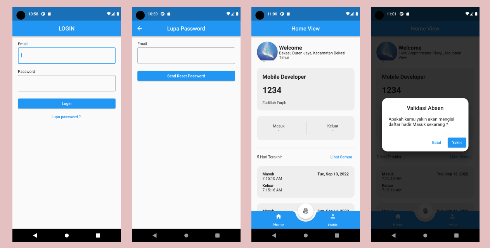
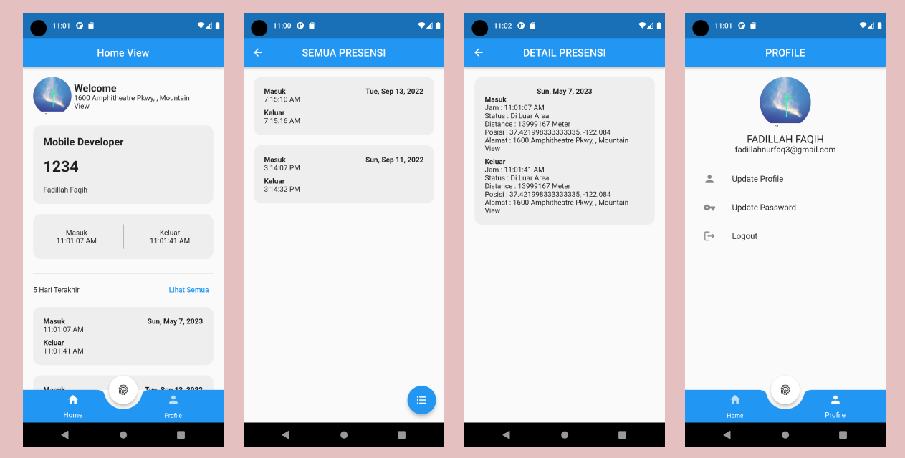
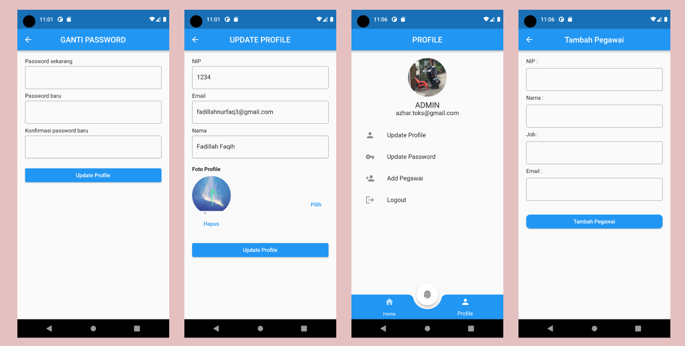

# Aplikasi Absensi (Valuenotifier State Management) 


## Link Aplikasi
https://drive.google.com/file/d/1mKn-gLXGwwzs66XXznBHsnAuXUx-QbXF/view

## User untuk test aplikasi
email : fadillahnurfaq3@gmail.com
password : 1233321

## Getting Started

Pastikan sudah menginstall Git dan Flutter pada environment kalian.

### Prerequisites

- Flutter
  ```sh
  https://docs.flutter.dev/get-started/install
  ```
- Git
  ```sh
  https://git-scm.com/downloads
  ```
  
### Installation

1. Clone the repo
   ```sh
   git clone https://github.com/fadillahnurfaq/absensi
   ```
2. Install the dependencies
   ```sh
   flutter pub get
   ```
3. Run
   ```sh
   Run Without Debugging On Vs Code
   ```

## Detail Aplikasi







## Dependencies
Berikut ini merupakan dependencies yang digunakan dalam project ini:

### Firebase/Firestore
- cloud_firestore: ^3.4.6
- firebase_auth: ^3.7.0
- firebase_core: ^1.21.1
- firebase_storage: ^10.3.7


### ETC
- flutter_launcher_icons: ^0.10.0
- cupertino_icons: ^1.0.2
- geocoding: ^2.0.5
- geolocator: ^9.0.1
- image_picker: ^0.8.5+3
- syncfusion_flutter_datepicker: ^20.2.48
- intl: ^0.17.0
